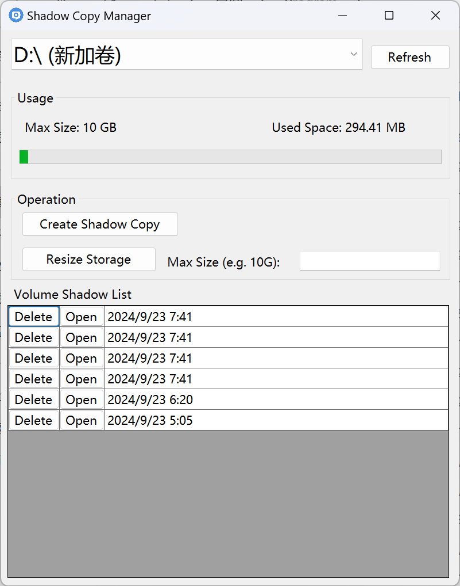

# Shadow Copy Manager

### Note: I ask AI to write the whole program (including the icon and readme), so I don't know anything what it's doing.

## Overview
Windows deletes the Volume Shadow Copy tab starting from Windows 10.

This program is a simple GUI tool that brings VSS back.

## Features
- List available disk volumes
- Display the maximum size allocated for shadow storage on each volume
- Create new shadow copies
- View existing shadow copies with their creation times
- Delete individual shadow copies
- Automatic elevation to run with administrator privileges

## Requirements
- Windows operating system (Windows 7 or later recommended)
- .NET 8.0 or later
- Administrator privileges (the application will prompt for elevation if needed)

## Installation
1. Download the latest release from the [releases page](https://github.com/yourusername/ShadowCopyManager/releases).
2. Extract the ZIP file to your desired location.
3. Run the `ShadowCopyManager.exe` file.

## Usage
1. Launch the application. If you're not running as an administrator, the app will prompt for elevation.
2. Select a disk volume from the dropdown menu.
3. The current maximum size allocated for shadow storage on the selected volume will be displayed.
4. To create a new shadow copy, click the "Create Shadow Copy" button.
5. Existing shadow copies will be listed in the table, showing their creation times.
6. To delete a shadow copy, click the "Delete" button next to the desired entry.
7. Use the "Refresh" button to update the list of shadow copies and the maximum size information.

## Troubleshooting
- If you encounter any "Access Denied" errors, ensure that you're running the application as an administrator.
- If no volumes are displayed in the dropdown, check that your account has sufficient privileges to access volume information.
- For any other issues, please check the Windows Event Viewer for detailed error logs.

## Contributing
Contributions to the Shadow Copy Manager are welcome! Please feel free to submit pull requests or create issues for bugs and feature requests.

## License
This project is licensed under the MIT License - see the [LICENSE.md](LICENSE.md) file for details.

## Disclaimer
This tool interacts with system-level components. While it's designed to be safe, please use it responsibly. Always ensure you have backups of important data before manipulating shadow copies.

## Acknowledgments
- This application uses the Windows Management Instrumentation (WMI) to interact with the Volume Shadow Copy Service.
- Thanks to all contributors and users for their support and feedback.